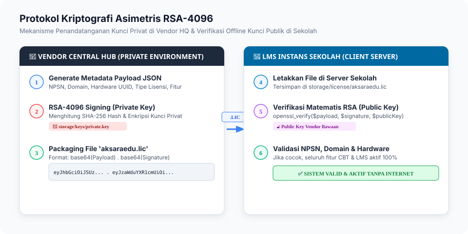

# 01. Arsitektur Sistem & Spesifikasi Lisensi

Dokumen ini menjelaskan rancangan arsitektur teknis **AksaraEdu Central Hub**, sistem lisensi berbasis kriptografi asimetris RSA-4096, serta perbedaan mendasar antara skema **Beli Putus (On-Premise)** dan **Berlangganan (SaaS)**.

---

## 1. Arsitektur Komponen & Ekosistem

AksaraEdu Central Hub dibangun di atas tumpukan teknologi modern:
* **Backend**: Laravel 12 / PHP 8.3+ (REST API Gateway, CLI Scheduler, Eloquent ORM).
* **Frontend**: Inertia.js + Vue 3, Tailwind CSS, Lucide Icons, Shadcn UI Tokens.
* **Basis Data**: PostgreSQL 16 / MariaDB 10.11+ dengan UUIDv7 sebagai *Primary Key*.
* **Cryptographic Layer**: OpenSSL RSA 4096-bit Digital Signature Engine.
* **Storage**: Terisolasi di `storage/keys` untuk kunci privat dan `storage/app/updates` untuk file paket rilis.


---

## 2. Perbandingan Model Lisensi

| Parameter | 💼 Model Beli Putus (On-Premise) | ☁️ Model Berlangganan (SaaS) |
| :--- | :--- | :--- |
| **Hak Kepemilikan Sistem** | Hak pakai seumur hidup (*Perpetual License*) pada domain/hardware terdaftar. | Hak sewa layanan selama durasi kontrak aktif (tahunan). |
| **Lokasi Server & Data** | Server lokal sekolah (Bare Metal / Local Mini Server / Cloud VPS milik sekolah). | Cloud Server yang dikelola Vendor / Partner MitraNet. |
| **Ketergantungan Internet** | **100% Offline Capable**. Tidak wajib terhubung ke Central Hub untuk kegiatan harian/CBT. | Memerlukan koneksi berkala untuk ping *Heartbeat* (sinkronisasi setiap 24 jam). |
| **Garansi & Bugfix** | Termasuk **Garansi Bugfix 3 Bulan** sejak tanggal serah terima. Dapat diperpanjang via SLA Maintenance. | Garansi, bugfix, dan pembaruan kurikulum **inklusif** selama masa langganan aktif. |
| **Fitur Update & Rilis** | Mendapatkan patch bugfix versi mayor yang dibeli. Upgrade fitur mayor baru dikenakan biaya rilis. | Otomatis mendapatkan pembaruan minor, patch, dan penyesuaian kurikulum nasional. |
| **Struktur Biaya** | 1x Investasi Awal (*CapEx*) + Opsional Kontrak Maintenance tahunan. | Biaya Operasional Rutin Tahunan (*OpEx*) yang terjangkau. |

---

## 3. Mekanisme Kriptografi RSA-4096

Untuk mencegah pembajakan dan menjamin integritas data lisensi tanpa mengharuskan server klien selalu daring, sistem menggunakan tanda tangan asimetris:



### 3.1. Struktur Payload Lisensi
Central Hub menyusun payload metadata sebelum penandatanganan:
```json
{
  "license_id": "01918a22-3c11-7890-a123-abcdef012345",
  "nomor_lisensi": "LIC-2026-SMK-20104050",
  "serial_key": "AKSR-2026-SMK-9901-XYZA",
  "npsn": "20104050",
  "nama_sekolah": "SMK Negeri 1 Aksara Nusantara",
  "tipe_sekolah": "smk",
  "model_lisensi": "beli_putus",
  "tier_paket": "enterprise",
  "domain_terdaftar": "lms.smkn1aksara.sch.id",
  "hardware_fingerprint": "a1b2c3d4-e5f6-7890-abcd-ef1234567890",
  "tanggal_rilis": "2026-08-29",
  "tanggal_kadaluarsa": null,
  "garansi_bugfix_hingga": "2026-11-29",
  "allowed_features": [
    "cbt_engine",
    "kurikulum_merdeka",
    "multimedia_materials",
    "leger_nilai",
    "presensi_qr",
    "rapor_otomatis"
  ],
  "issuer": "AksaraEdu Central Hub Licensing Authority",
  "issued_at": "2026-08-29T12:00:00+08:00"
}
```

### 3.2. Format Paket File Lisensi (`aksaraedu.lic`)
Paket lisensi yang didownload atau dikirimkan ke sekolah memiliki format:
```text
BASE64_ENCODED_JSON_PAYLOAD . BASE64_ENCODED_RSA_SHA256_SIGNATURE
```

### 3.3. Algoritma Verifikasi pada Sisi Klien
1. Klien membaca file `storage/license/aksaraedu.lic`.
2. Memisahkan string berdasarkan tanda titik (`.`) menjadi `payload` dan `signature`.
3. Memverifikasi signature menggunakan **RSA Public Key** bawaan vendor:
   ```php
   $isSignatureValid = openssl_verify($rawJsonPayload, $binarySignature, $vendorPublicKey, OPENSSL_ALGO_SHA256);
   ```
4. Jika tanda tangan valid, sistem memverifikasi kesesuaian:
   * `npsn` cocok dengan konfigurasi sekolah.
   * `domain_terdaftar` sesuai dengan Host header HTTP request.
   * `hardware_fingerprint` sesuai dengan UUID hardware mesin lokal (jika fitur *Hardware Binding* aktif).
   * Tanggal saat ini tidak melebihi `tanggal_kadaluarsa` (untuk model SaaS).

---

## 4. Status Siklus Hidup Lisensi (*Lifecycle States*)

1. **Active**: Lisensi valid dan seluruh fitur LMS, CBT, dan Penilaian dapat diakses secara penuh.
2. **Grace Period** (*Khusus SaaS*): Masa tenggang 14 hari pasca jatuh tempo. Sistem menampilkan banner peringatan kepada Admin Sekolah tanpa menghentikan aktivitas belajar siswa.
3. **Expired**: Masa aktif habis. Sistem beralih ke mode *Read-Only Archive* (data dapat dilihat/diekspor, namun pembuatan ujian baru dinonaktifkan hingga perpanjangan selesai).
4. **Revoked**: Lisensi dicabut secara permanen karena pelanggaran perjanjian lisensi pengguna akhir (EULA).
