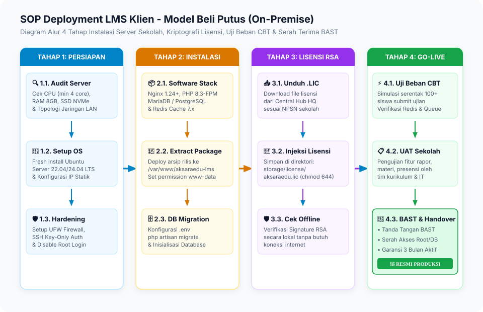
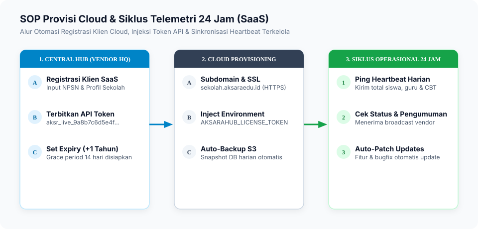
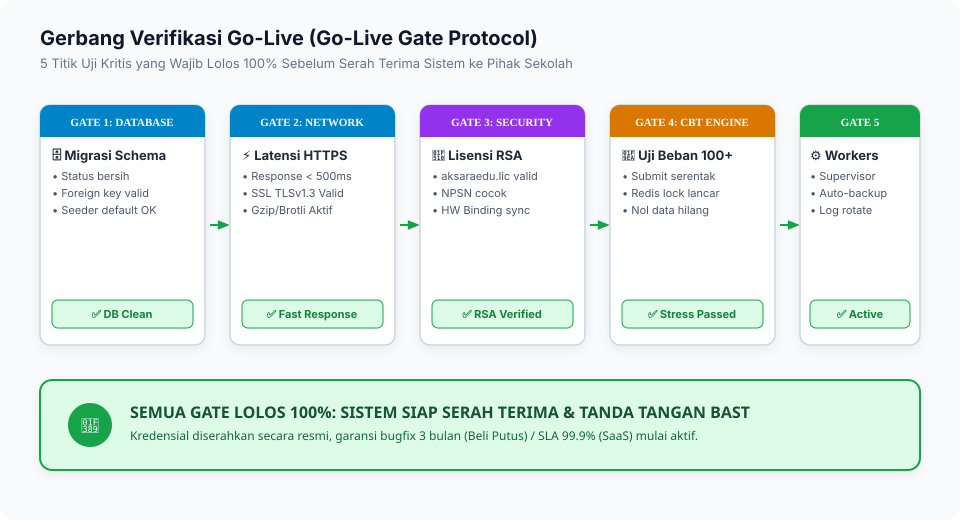

# 02. SOP Deployment & Provisioning Sistem

Standar Operasional Prosedur (SOP) ini mengatur tata cara deployment, instalasi, dan provisi lingkungan produksi untuk:

1. **AksaraEdu Central Hub** (Server Pusat Vendor HQ).
2. **AksaraEdu LMS - Model Beli Putus** (Server On-Premise / Bare Metal / VPS Sekolah).
3. **AksaraEdu LMS - Model Berlangganan** (Cloud Managed Instance).

---

## 1. Matriks Spesifikasi Infrastruktur & Prasyarat

### 1.1. Rekomendasi Hardware Server

| Tipe Beban Kerja                        | Kapasitas Pengguna     | CPU    | RAM   | Storage (NVMe/SSD) | Bandwidth             |
| :-------------------------------------- | :--------------------- | :----- | :---- | :----------------- | :-------------------- |
| **AksaraEdu Central Hub (HQ)**          | Seluruh Klien Nasional | 4 Core | 8 GB  | 100 GB SSD         | 100 Mbps Dedicated    |
| **LMS Sekolah (Kecil - < 500 Siswa)**   | 500 Siswa Concurrent   | 2 Core | 4 GB  | 50 GB SSD          | 50 Mbps / LAN 1 Gbps  |
| **LMS Sekolah (Sedang - 500-1.500)**    | 1.500 Siswa Concurrent | 4 Core | 8 GB  | 120 GB SSD         | 100 Mbps / LAN 1 Gbps |
| **LMS Sekolah (Besar - > 1.500 Siswa)** | 2.500+ Concurrent CBT  | 8 Core | 16 GB | 250 GB NVMe        | 250 Mbps / LAN 1 Gbps |

### 1.2. Kebutuhan Perangkat Lunak (Software Stack)

- **Sistem Operasi**: Ubuntu Server 22.04 LTS atau 24.04 LTS.
- **Web Server**: Nginx (1.24+).
- **PHP Engine**: PHP 8.3 / 8.4 dengan ekstensi: `php-fpm`, `php-cli`, `php-bcmath`, `php-curl`, `php-gd`, `php-intl`, `php-mbstring`, `php-mysql` atau `php-pgsql`, `php-opcache`, `php-readline`, `php-xml`, `php-zip`, `php-redis`.
- **Database**: MySQL 8.0+ / MariaDB 10.11+ atau PostgreSQL 16+.
- **Cache & Queue Driver**: Redis 7.x.
- **Process Manager**: Supervisor (untuk worker background & cron scheduler).
- **SSL Certificate**: Let's Encrypt Certbot atau Custom Commercial SSL.

---

## 2. Prosedur Deployment Central Hub (Vendor HQ)

### Langkah Teknis Central Hub:

1. **Clone dan Pasang Dependensi**:
    ```bash
    cd /var/www/aksaraedu-hub
    composer install --no-dev --optimize-autoloader
    npm install && npm run build
    ```
2. **Setup Konfigurasi Environment**:
    ```bash
    cp .env.example .env
    php artisan key:generate
    ```
    Pastikan konfigurasi database dan app URL terisi:
    ```env
    APP_NAME="AksaraEdu Central Hub"
    APP_ENV=production
    APP_DEBUG=false
    APP_URL=https://hub.aksaraedu.id

    DB_CONNECTION=mysql
    DB_HOST=127.0.0.1
    DB_PORT=3306
    DB_DATABASE=aksara_hub
    DB_USERNAME=aksara_hub_user
    DB_PASSWORD=SecurePasswordHub2026!
    ```
3. **Inisialisasi Kunci Kriptografi RSA-4096**:
    ```bash
    mkdir -p storage/keys
    openssl genrsa -out storage/keys/license_private.key 4096
    openssl rsa -in storage/keys/license_private.key -pubout -out storage/keys/license_public.key
    chmod 600 storage/keys/license_private.key
    chmod 644 storage/keys/license_public.key
    chown -R www-data:www-data storage/keys
    ```
4. **Migrasi Database & Inisialisasi Akun Superadmin**:
    ```bash
    php artisan migrate --force
    php artisan db:seed --force
    ```

---

## 3. SOP Deployment LMS Klien - Model Beli Putus (On-Premise)

Model Beli Putus ditujukan untuk instalasi pada server milik sekolah (lokal di lab komputer sekolah atau VPS mandiri milik yayasan).



### Langkah Teknis Deployment On-Premise:

1. **Persiapan Direktori & Permission**:
    ```bash
    sudo mkdir -p /var/www/aksaraedu-lms
    sudo chown -R www-data:www-data /var/www/aksaraedu-lms
    ```
2. **Deploy Source Package**:
   Salin arsip rilis `aksaraedu-lms-v1.x.x.tar.gz` yang telah ter-compile, lalu ekstrak:
    ```bash
    tar -xzf aksaraedu-lms-v1.x.x.tar.gz -C /var/www/aksaraedu-lms/
    cd /var/www/aksaraedu-lms
    ```
3. **Konfigurasi Lingkungan (`.env`)**:
    ```env
    APP_NAME="AksaraEdu LMS"
    APP_ENV=production
    APP_DEBUG=false
    APP_URL=https://lms.smkn1contoh.sch.id

    # Profil Lembaga
    SCHOOL_NPSN=20104050
    SCHOOL_NAME="SMK Negeri 1 Contoh"
    SCHOOL_TYPE=smk

    # Database Lokal
    DB_CONNECTION=mysql
    DB_HOST=127.0.0.1
    DB_DATABASE=aksara_lms_db
    DB_USERNAME=aksara_user
    DB_PASSWORD=SandiKuatLokal2026!

    # Driver Performa
    CACHE_STORE=redis
    SESSION_DRIVER=redis
    QUEUE_CONNECTION=redis
    ```
4. **Pemasangan File Lisensi (`aksaraedu.lic`)**:
    - Unduh file lisensi bertanda tangan RSA dari Central Hub Vendor.
    - Letakkan di direktori:
        ```bash
        mkdir -p storage/license
        cp aksaraedu.lic storage/license/aksaraedu.lic
        chmod 644 storage/license/aksaraedu.lic
        chown -R www-data:www-data storage/license
        ```
5. **Migrasi Database & Optimization**:
    ```bash
    php artisan migrate --force
    php artisan config:cache
    php artisan route:cache
    php artisan view:cache
    ```

---

## 4. SOP Deployment LMS Klien - Model Berlangganan (SaaS Cloud)



### Karakteristik Deployment SaaS:

- Menggunakan **API Token Lisensi** (`token_api`) untuk sinkronisasi otomatis.
- Mengaktifkan cron scheduler untuk mengirimkan **Heartbeat Telemetri** setiap 24 jam ke `https://hub.aksaraedu.id/api/v1/license/heartbeat`.
- Otomatisasi backup berkala ke cloud object storage (S3 / R2).

### Konfigurasi Sinkronisasi Lisensi Cloud di `.env`:

```env
AKSARAHUB_CENTRAL_URL=https://hub.aksaraedu.id
AKSARAHUB_LICENSE_TOKEN=aksr_live_abcdef01234567890abcdef...
AKSARAHUB_AUTO_HEARTBEAT=true
```

---

## 5. Konfigurasi Nginx Web Server Produksi

Gunakan template konfigurasi Nginx berkinerja tinggi dengan kompresi gzip dan caching aset statis:

```nginx
server {
    listen 80;
    server_name lms.sekolah.sch.id;
    return 301 https://$host$request_uri;
}

server {
    listen 443 ssl http2;
    server_name lms.sekolah.sch.id;
    root /var/www/aksaraedu-lms/public;

    ssl_certificate /etc/letsencrypt/live/lms.sekolah.sch.id/fullchain.pem;
    ssl_certificate_key /etc/letsencrypt/live/lms.sekolah.sch.id/privkey.pem;
    ssl_protocols TLSv1.2 TLSv1.3;
    ssl_ciphers HIGH:!aNULL:!MD5;

    index index.php index.html;
    charset utf-8;

    # Optimasi Upload Berkas Ujian & Materi Multimedia
    client_max_body_size 100M;
    client_body_buffer_size 128k;

    # Security Headers
    add_header X-Frame-Options "SAMEORIGIN";
    add_header X-Content-Type-Options "nosniff";
    add_header X-XSS-Protection "1; mode=block";
    add_header Referrer-Policy "strict-origin-when-cross-origin";

    location / {
        try_files $uri $uri/ /index.php?$query_string;
    }

    location = /favicon.ico { access_log off; log_not_found off; }
    location = /robots.txt  { access_log off; log_not_found off; }

    # Caching Static Assets
    location ~* \.(jpg|jpeg|png|gif|ico|css|js|woff|woff2|ttf|svg)$ {
        expires 30d;
        add_header Cache-Control "public, no-transform";
        access_log off;
    }

    # PHP-FPM Handler
    location ~ \.php$ {
        fastcgi_pass unix:/var/run/php/php8.3-fpm.sock;
        fastcgi_param SCRIPT_FILENAME $realpath_root$fastcgi_script_name;
        include fastcgi_params;
        fastcgi_hide_header X-Powered-By;
        fastcgi_read_timeout 180;
    }

    location ~ /\.(?!well-known).* {
        deny all;
    }
}
```

---

## 6. Konfigurasi Process Supervisor & Cron Scheduler

### 6.1. Supervisor Worker Queue (`/etc/supervisor/conf.d/aksara-worker.conf`)

```ini
[program:aksara-worker]
process_name=%(program_name)s_%(process_num)02d
command=php /var/www/aksaraedu-lms/artisan queue:work redis --sleep=3 --tries=3 --max-time=3600
autostart=true
autorestart=true
stopasgroup=true
killasgroup=true
user=www-data
numprocs=2
redirect_stderr=true
stdout_logfile=/var/www/aksaraedu-lms/storage/logs/worker.log
stopwaitsecs=3600
```

### 6.2. Cron Job Scheduler Sistem

Tambahkan pada crontab user `www-data` (`sudo crontab -u www-data -e`):

```cron
* * * * * cd /var/www/aksaraedu-lms && php artisan schedule:run >> /dev/null 2>&1
```

---

## 7. Diagram Alur Verifikasi Pasca-Deployment (Go-Live Gate)



---

## 8. Otomatisasi Rilis & Publikasi ke Central Hub via GitHub Actions

AksaraEdu dilengkapi alur kerja otomatisasi CI/CD pada `.github/workflows/release-app.yml` yang berjalan setiap kali ada tag rilis baru (misal `v1.0.0`) yang di-push ke repository GitHub.

### Alur Kerja GitHub Actions:

```
[ Developer Push Tag: git push origin v1.0.0 ]
                       │
                       ▼
[ GitHub Actions: Setup Bun, PHP 8.3, Composer ]
                       │
                       ▼
[ Build Frontend (bun run build) & Optimize Vendor (--no-dev) ]
                       │
                       ▼
[ Kemas .zip Bersih & Hitung SHA-256 Checksum ]
                       │
         ┌─────────────┴─────────────┐
         ▼                           ▼
[ Publish GitHub Release ]   [ Upload & Register ke @hub API ]
(Lampirkan .zip & .sha256)   (POST /api/v1/updates/publish)
```

### Konfigurasi GitHub Repository Secrets:

Untuk mengaktifkan pengiriman otomatis ke `@hub`, tambahkan rahasia berikut pada menu **Settings &rarr; Secrets and variables &rarr; Actions**:

- **`HUB_API_URL`**: Domain portal Central Hub (contoh: `https://hub.aksaraedu.id`).
- **`HUB_DEPLOY_SECRET`**: Nilai token yang sama dengan `DEPLOY_WEBHOOK_SECRET` pada berkas `.env` Central Hub.

---

## 9. SOP Khusus Deployment Instans Demo Showcase (`demo.lms.id`)

1. **Registrasi Klien**: Daftarkan klien di `@hub` (`NPSN: 99999999`, Nama: `SMK Negeri 1 Aksara Nusantara (Demo Showcase)`), terbitkan lisensi dengan domain `demo.lms.id`.
2. **Environment Instans Demo**: Set `APP_ENV=demo`, `APP_URL=https://demo.lms.id`, `MAIL_MAILER=log`.
3. **Eksekusi Seeder Demo**: Jalankan `php artisan db:seed --class=DemoSeeder --force` (atau centang opsi demo di web installer `/install`).
4. **Auto-Reset Cron Job**: Pasang cron `0 */6 * * * php artisan migrate:fresh --force && php artisan db:seed --class=DemoSeeder --force` untuk menjaga kebersihan data demonstrasi.

