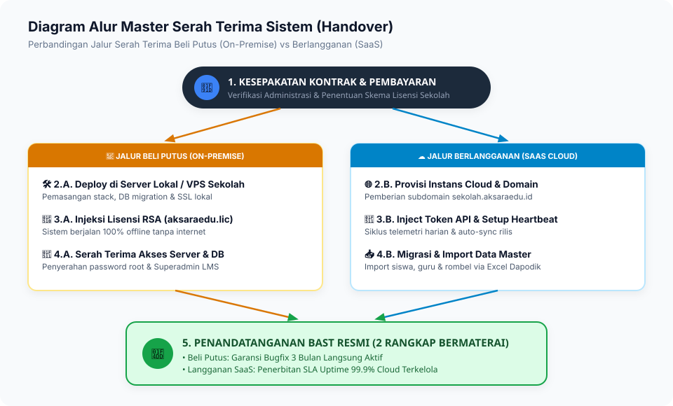
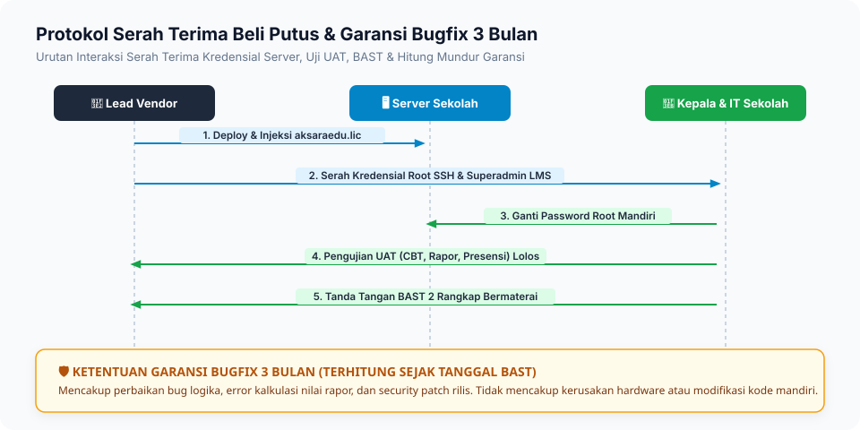
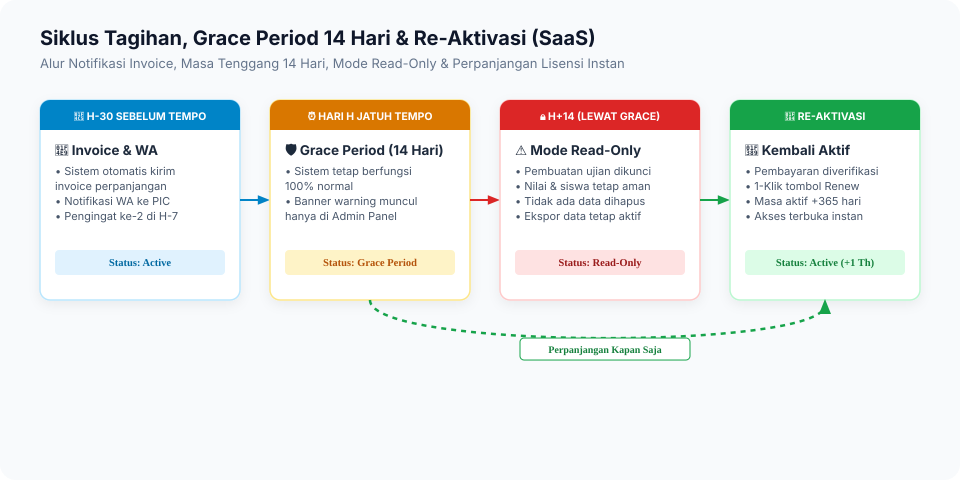

# 03. SOP Serah Terima (Handover) & Aktivasi Sistem

Dokumen ini merupakan Standar Operasional Prosedur (SOP) resmi mengenai proses serah terima (_Handover / Acceptance_) aplikasi **AksaraEdu LMS** antara pihak Pengembang (Vendor / MitraNet) dengan pihak Satuan Pendidikan (Klien Sekolah), baik untuk skema **Beli Putus (On-Premise)** maupun skema **Berlangganan (SaaS)**.

---

## 1. Diagram Alur Master Serah Terima Sistem



---

## 2. Prosedur Serah Terima Skema Beli Putus (On-Premise)



### 2.1. Komponen yang Diserahterimakan

Pada skema Beli Putus, pihak sekolah memperoleh kepemilikan operasional penuh atas instans perangkat lunak yang terpasang di infrastruktur sekolah:

1. **Paket Perangkat Lunak Terpasang**:
    - Seluruh kode program ter-compile siap jalan di server sekolah (`/var/www/aksaraedu-lms`).
    - Database produksi bersih yang telah terinisialisasi.
2. **Kredensial & Hak Akses Penuh**:
    - Akun Superadmin LMS (`admin@sekolah.sch.id`).
    - Akses database lokal (MySQL / MariaDB / PostgreSQL).
    - Akses server (SSH / Root / Panel Hosting) diserahkan secara aman dan kata sandi diubah oleh pihak sekolah.
3. **Paket Lisensi Kriptografis**:
    - File lisensi resmi bertanda tangan RSA (`aksaraedu.lic`).
    - Sertifikat Hak Pakai Lisensi Resmi dari AksaraEdu Central Hub.
4. **Dokumentasi & Panduan**:
    - Panduan Admin Operator & Panduan Guru Pembuat Ujian CBT.
    - Prosedur Backup & Restore Database Lokal Mandiri.
5. **Jaminan Garansi Bugfix**:
    - **Garansi Bugfix 3 Bulan** terhitung sejak tanggal penandatanganan BAST.
    - Layanan penanganan kendala teknis darurat via Helpdesk Central Hub.

### 2.2. Klausul Garansi Bugfix 3 Bulan (Beli Putus)

- **Cakupan Garansi**:
    - Perbaikan kesalahan logika program (_logical software bugs_).
    - Perbaikan ketidaksesuaian fungsi CBT, penilaian kurikulum merdeka, atau rapor yang tidak berjalan sesuai spesifikasi awal.
    - Pembaruan patch keamanan (_security patches_) versi rilis terkait.
- **Di Luar Cakupan Garansi (Non-Warranty)**:
    - Kerusakan perangkat keras (HDD/SSD crash, server terbakar, listrik padam tanpa UPS).
    - Kerusakan akibat modifikasi kode mandiri oleh pihak sekolah tanpa izin vendor.
    - Permintaan penambahan fitur baru di luar lingkup kontrak pembelian awal.

---

## 3. Prosedur Serah Terima Skema Berlangganan (SaaS)



### 3.1. Komponen yang Diserahterimakan

1. **URL Akses Cloud LMS**: Domain resmi sekolah (contoh: `https://lms.sekolah.sch.id` atau `https://sekolah.aksaraedu.id`).
2. **Akun Administrator Sekolah**: Akses level Kepala Sekolah, Waka Kurikulum, dan Operator IT.
3. **Jaminan Layanan (SLA Uptime 99.9%)**: Infrastruktur cloud terkelola dengan auto-backup berkala, pemeliharaan server, dan pembaruan sistem berkelanjutan.
4. **Dukungan Teknis Penuh**: Akses tiket prioritas selama masa langganan aktif.

### 3.2. Prosedur Siklus Perpanjangan Kontrak (SaaS)

1. **H-30 Sebelum Jatuh Tempo**: Central Hub mengirimkan email otomatis dan WhatsApp notifikasi tagihan perpanjangan kepada PIC Sekolah.
2. **H-7 Sebelum Jatuh Tempo**: Peringatan kedua disertai penerbitan Invoice Resmi.
3. **Hari H (Jatuh Tempo)**: Jika belum ada pembayaran, sistem memasuki status **Grace Period (14 Hari)**. Sistem tetap berfungsi normal dengan banner pengingat admin.
4. **H+14 (Pasca Grace Period)**: Jika konfirmasi pembayaran belum diterima, sistem masuk ke mode **Read-Only** (data aman, tidak ada data yang dihapus).
5. **Re-Aktivasi**: Begitu pembayaran diverifikasi, admin vendor mengklik tombol _Renew_ pada Central Hub dan instans langsung aktif seketika tanpa perlu konfigurasi ulang.

---

## 4. Format Dokumen Berita Acara Serah Terima (BAST)

Berikut adalah template standar Berita Acara Serah Terima yang wajib dicetak 2 rangkap bermaterai dan ditandatangani oleh kedua belah pihak:

```text
================================================================================
                    BERITA ACARA SERAH TERIMA (BAST)
                     PENGADAAN SISTEM AKSARAEDU LMS
                        Nomor: BAST/AKSR/2026/____
================================================================================

Pada hari ini, _________ tanggal ___ bulan ___________ tahun Dua Ribu Dua Puluh Enam (___-___-2026),
kami yang bertanda tangan di bawah ini:

I.  PIHAK PERTAMA (PENGEMBANG / VENDOR):
    Nama Perusahaan   : PT Mitranet Solusi Edukasi / AksaraEdu HQ
    Nama Penanggung Jawab: __________________________________________________
    Jabatan           : Lead Implementation / Project Manager
    Alamat Kantor     : __________________________________________________
    Dalam hal ini bertindak untuk dan atas nama AksaraEdu, selanjutnya disebut PIHAK PERTAMA.

II. PIHAK KEDUA (SATUAN PENDIDIKAN / KLIEN):
    Nama Sekolah      : __________________________________________________
    NPSN              : __________________________________________________
    Nama Kepala/PIC   : __________________________________________________
    Jabatan           : Kepala Sekolah / Ketua Tim Pengadaan IT
    Alamat Sekolah    : __________________________________________________
    Dalam hal ini bertindak untuk dan atas nama Satuan Pendidikan, selanjutnya disebut PIHAK KEDUA.

--------------------------------------------------------------------------------
DENGAN INI MENYATAKAN BAHWA:
1. PIHAK PERTAMA telah menyelesaikan pekerjaan instalasi, konfigurasi, pengujian (UAT),
   dan pelatihan operasional perangkat lunak AKSARAEDU LMS sesuai rincian berikut:

   a. Skema Lisensi       : [  ] Beli Putus (On-Premise)    [  ] Berlangganan (SaaS)
   b. Nomor Lisensi Resmi : __________________________________________________
   c. Serial Key          : __________________________________________________
   d. Domain / URL Sistem : __________________________________________________
   e. Masa Garansi Bugfix : s.d. Tanggal ___ / ___________ / 2026 (Khusus Beli Putus)
   f. Periode Kontrak     : ___/___/2026 s.d. ___/___/2027 (Khusus SaaS)

2. PIHAK KEDUA telah melakukan pemeriksaan, pengujian fungsi fitur utama (CBT, Manajemen
   Materi, Presensi, dan Pengolahan Nilai), serta menerima serah terima seluruh hak akses
   dan dokumentasi dalam kondisi baik dan berfungsi 100%.

3. Seluruh hak cipta dan merek dagang AksaraEdu tetap melekat pada PIHAK PERTAMA.
   PIHAK KEDUA memiliki hak pakai sah sesuai skema lisensi yang dipilih dan dilarang
   mendistribusikan ulang, menyalin tanpa izin, atau memperjualbelikan kode sumber kepada pihak lain.

Demikian Berita Acara Serah Terima ini dibuat dalam rangkap 2 (dua) bermaterai cukup dan memiliki
kekuatan hukum yang sama setelah ditandatangani oleh kedua belah pihak.

Diserahkan oleh,                               Diterima oleh,
PIHAK PERTAMA (Vendor)                         PIHAK KEDUA (Sekolah)
PT Mitranet Solusi Edukasi                     Satuan Pendidikan Mitra


( ____________________________ )               ( ____________________________ )
NIP/Jabatan:                                   NIP: Kepala Sekolah
Materai Rp10.000                               Stempel Resmi Sekolah
```

---

## 5. Lampiran Checklist User Acceptance Testing (UAT)

Sebelum penandatanganan BAST, tim implementor dan perwakilan IT sekolah wajib mencentang lembar checklist berikut:

| No  | Modul Uji                | Skenario Pengujian                                          | Hasil Uji (Lolos/Gagal) | Paraf Penguji |
| :-- | :----------------------- | :---------------------------------------------------------- | :---------------------- | :------------ |
| 1   | **Autentikasi & RBAC**   | Login Admin, Guru, Siswa, dan Orang Tua sesuai hak akses.   | [ ] Lolos               |               |
| 2   | **Import Master Data**   | Import data rombel, guru, dan 500+ siswa via Excel.         | [ ] Lolos               |               |
| 3   | **Engine CBT Ujian**     | Simulasi serentak 100 siswa mengerjakan soal acak & gambar. | [ ] Lolos               |               |
| 4   | **Pengamanan Ujian**     | Anti-cheat timer, deteksi perpindahan tab, submit otomatis. | [ ] Lolos               |               |
| 5   | **Pengolahan Nilai**     | Perhitungan otomatis rapor Kurikulum Merdeka & K13.         | [ ] Lolos               |               |
| 6   | **Lisensi & Verifikasi** | Status lisensi aktif & terdaftar resmi di portal pusat.     | [ ] Lolos               |               |
| 7   | **Backup Mandiri**       | Pengujian ekspor cadangan database ke file `.sql.gz`.       | [ ] Lolos               |               |
