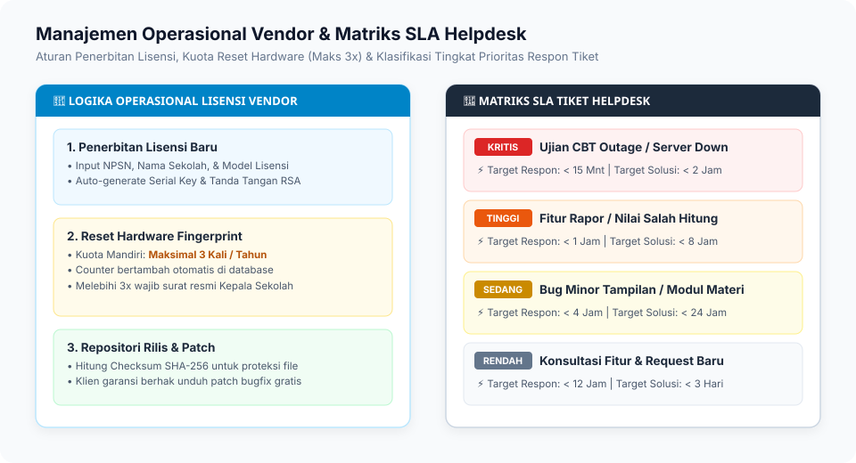

# 04. Panduan Operasional Vendor & Helpdesk Support

Dokumen ini adalah panduan kerja operasional bagi tim internal Vendor (**Admin Vendor**, **Account Manager**, **DevOps Engineer**, dan **Customer Support**) dalam mengoperasikan panel kontrol **AksaraEdu Central Hub**.

---

## 1. Navigasi Master Control Dashboard & Matriks SLA

Akses dashboard vendor melalui: `https://hub.aksaraedu.id/admin` (wajib login autentikasi terdaftar).



---

## 2. Prosedur Manajemen Lisensi (_Licensing Workflow_)

### 2.1. Menerbitkan Lisensi Baru (_Issue License_)

1. Buka menu **Master Lisensi** -> Klik tombol **"Terbitkan Lisensi Baru"**.
2. Pilih Klien Sekolah terdaftar (atau buat entri sekolah baru jika belum ada).
3. Isi parameter kontrak:
    - **Model Lisensi**: Pilih `Beli Putus (On-Premise)` atau `Langganan (SaaS)`.
    - **Tier Paket**: `Lite`, `Standar`, atau `Enterprise`.
    - **Domain Terdaftar**: Domain FQDN atau IP server sekolah (misal `lms.smkn1sby.sch.id`).
    - **Tanggal Rilis & Kadaluarsa**: Untuk _Beli Putus_, tanggal kadaluarsa otomatis `null` (seumur hidup) dan masa garansi bugfix diisi 3 bulan. Untuk _Langganan_, tanggal kadaluarsa diisi 1 tahun sejak aktivasi.
    - **Nilai Kontrak**: Catat nominal kesepakatan untuk laporan keuangan.
4. Klik **"Terbitkan & Tanda Tangani (RSA-4096)"**.
5. Sistem secara otomatis men-generate serial key, nomor lisensi, token API, dan signed license payload.
6. Klik tombol **"Unduh .LIC"** untuk menyerahkan berkas kepada sekolah.

### 2.2. Prosedur Reset Hardware Fingerprint

Jika server sekolah mengalami kerusakan perangkat keras (ganti motherboard/CPU/NIC) sehingga _Hardware UUID_ berubah:

1. Buka detail lisensi sekolah terkait di menu **Master Lisensi**.
2. Klik tombol **"Reset Hardware Fingerprint"**.
3. Sistem akan mengosongkan nilai fingerprint lama dan menambah counter `hardware_reset_count`.
4. Saat server sekolah dijalankan kembali, sistem LMS akan mengikat hardware baru secara otomatis.

> [!WARNING]
> Batas toleransi reset hardware mandiri adalah maksimal **3 kali per tahun**. Melebihi kuota tersebut memerlukan verifikasi surat pernyataan resmi dari Kepala Sekolah.

---

## 3. Repositori Rilis & Distribusi Patch (_Release Management_)

### 3.1. Langkah Mengunggah Rilis Baru

1. Buka menu **Repositori Rilis** -> Klik **"Unggah Rilis Baru"**.
2. Masukkan metadata rilis:
    - **Nomor Versi**: Menggunakan _Semantic Versioning_ (contoh: `1.0.1`, `1.1.0`, `2.0.0`).
    - **Tipe Rilis**: `Patch Bugfix`, `Minor Feature`, atau `Major Curriculum`.
    - **Ringkasan Perubahan (Changelog)**: Tuliskan rincian perbaikan poin per poin.
    - **Minimal Versi LMS**: Versi dasar minimum yang diperlukan sebelum apply patch ini.
    - **File Arsip (ZIP/TAR.GZ)**: Unggah berkas pembaruan terkompresi.
3. Central Hub secara otomatis menghitung checksum SHA-256 berkas.
4. Klik **"Publikasikan Rilis"**.

---

## 4. Standar Operasional Helpdesk & Matriks SLA Tiket

Setiap laporan kendala dari operator sekolah yang masuk melalui helpdesk Central Hub diklasifikasikan berdasarkan Service Level Agreement (SLA):

| Tingkat Prioritas     | Kriteria Kendala                                                                                    | Target Waktu Respon Awal | Target Penyelesaian (Resolution Time) |
| :-------------------- | :-------------------------------------------------------------------------------------------------- | :----------------------- | :------------------------------------ |
| **Kritis (Critical)** | Ujian CBT sedang berlangsung dan sistem lumpuh total (_outage_).                                    | **< 15 Menit**           | **< 2 Jam**                           |
| **Tinggi (High)**     | Fitur vital bermasalah (contoh: kalkulasi nilai rapor salah) mendekati batas waktu pembagian rapor. | **< 1 Jam**              | **< 8 Jam**                           |
| **Sedang (Medium)**   | Kendala minor pada modul materi, tampilan UI, atau pertanyaan konfigurasi reguler.                  | **< 4 Jam**              | **< 24 Jam**                          |
| **Rendah (Low)**      | Saran peningkatan fitur, permintaan tema khusus, atau konsultasi umum.                              | **< 12 Jam**             | **< 3 Hari Kerja**                    |

---

## 5. Pengelolaan Leads & Demo CRM

1. Calon klien yang mengajukan permohonan demo instan melalui landing page akan masuk ke menu **Leads & Demo CRM**.
2. Sistem otomatis menyediakan akun sandbox demo instan berdurasi 2 jam.
3. Tim Sales / Account Executive wajib menghubungi nomor WhatsApp pemohon dalam waktu **maksimal 1x24 jam** untuk menawarkan konsultasi kebutuhan (apakah cocok dengan model Beli Putus atau Berlangganan).
4. Update status lead dari `Baru` -> `Dihubungi` -> `Presentasi` -> `Deal (Menjadi Klien)` atau `Lost`.

---

## 6. SOP Registrasi & Tata Cara Hosting Aplikasi Demo Showcase (`demo.lms.id`)

Untuk menyediakan server demo publik yang siap diuji coba oleh calon klien dan mitra sekolah:

### A. Registrasi Instans Demo di Central Hub:

1. Buka menu **Manajemen Sekolah Mitra (`/admin/klien`)** -> **Tambah Klien**:
    - **NPSN**: `99999999` _(NPSN khusus demo showcase)_
    - **Nama Sekolah**: `SMK Negeri 1 Aksara Nusantara (Demo Showcase)`
    - **Tipe Sekolah**: `SMK` (atau `SMA`)
    - **Status Klien**: `aktif`
2. Buka menu **Lisensi Klien (`/admin/lisensi`)** -> **Terbitkan Lisensi**:
    - Pilih sekolah demo di atas, set domain `demo.lms.id`, model `Beli Putus` / `Berlangganan`.
    - Unduh berkas `aksaraedu.lic`.

### B. Tata Cara Hosting & Deployment Instans Demo (`[APP]`):

1. **Konfigurasi Lingkungan (`.env`)**:
    ```env
    APP_ENV=demo
    APP_URL=https://demo.lms.id
    MAIL_MAILER=log
    ```
2. **Pemasangan & Seeding Showcase**:
    - Pasang file `aksaraedu.lic` pada `storage/license/aksaraedu.lic`.
    - Jalankan: `php artisan migrate:fresh --force && php artisan db:seed --class=DemoSeeder --force` _(atau pilih opsi "Pasang Data Contoh Demo" pada web installer `/install`)_.
3. **Akun Akses Showcase** (Password: `demo12345`):
    - Admin: `admin@demo.lms.id`
    - Guru: `guru@demo.lms.id`
    - Siswa: `siswa@demo.lms.id`
4. **Otomasi Pembersihan Berkala (Cron Reset Self-Healing)**:
   Pasang cron job di server hosting demo untuk me-reset data setiap 6 jam:
    ```bash
    0 */6 * * * cd /var/www/demo-lms && php artisan migrate:fresh --force && php artisan db:seed --class=DemoSeeder --force && php artisan optimize:clear
    ```
