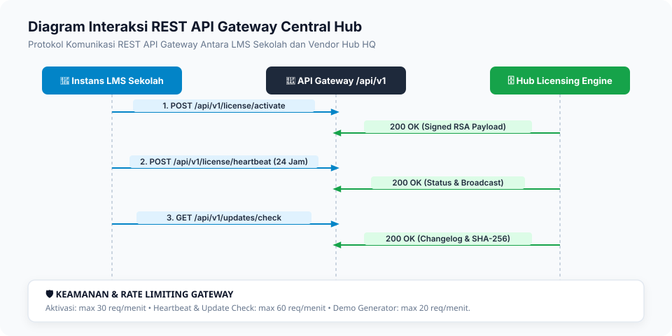

# 05. Panduan Integrasi API Gateway & Telemetri

Dokumen ini merupakan referensi teknis lengkap antarmuka pemrograman aplikasi (**REST API Gateway**) pada **AksaraEdu Central Hub** (`/api/v1/`).

---

## 1. Standar & Keamanan API

- **Base URL**: `https://hub.aksaraedu.id/api/v1`
- **Format Data**: `application/json` (Encoding: UTF-8).
- **Autentikasi Token**: `Authorization: Bearer <token_api_lisensi>`.
- **Rate Limiting**:
    - Aktivasi Lisensi: 30 request / menit.
    - Heartbeat Telemetri: 60 request / menit.
    - Verifikasi Publik NPSN: 60 request / menit.
    - Pengecekan Update: 60 request / menit.
    - Demo Generator: 20 request / menit.



---

## 2. Rincian Endpoint Gateway

### 2.1. Aktivasi Lisensi Instans Baru (`POST /api/v1/license/activate`)

Mendaftarkan mesin/domain instans sekolah ke Central Hub untuk memperoleh signed payload awal.

- **Request Header**: `Content-Type: application/json`
- **Request Body**:
    ```json
    {
        "npsn": "20104050",
        "serial_key": "AKSR-2026-SMK-9901-XYZA",
        "domain_host": "lms.smkn1aksara.sch.id",
        "hardware_fingerprint": "a1b2c3d4-e5f6-7890-abcd-ef1234567890",
        "versi_lms_terpasang": "1.0.0"
    }
    ```
- **Response 200 OK**:
    ```json
    {
        "status": "success",
        "message": "Lisensi berhasil diaktivasi secara sah.",
        "data": {
            "nomor_lisensi": "LIC-2026-SMK-20104050",
            "nama_sekolah": "SMK Negeri 1 Aksara Nusantara",
            "model_lisensi": "beli_putus",
            "tier_paket": "enterprise",
            "token_api": "aksr_live_9a8b7c6d5e4f...",
            "signed_license_payload": "eyJhbGciOiJSUzI1NiIs...",
            "garansi_bugfix_hingga": "2026-11-29",
            "tanggal_kadaluarsa": null
        }
    }
    ```

---

### 2.2. Heartbeat & Telemetri Klien (`POST /api/v1/license/heartbeat`)

Mengirimkan sinyal kesehatan sistem dan metrik agregat penggunaan secara periodik (setiap 24 jam).

- **Request Header**:
    - `Authorization: Bearer aksr_live_...`
    - `Content-Type: application/json`
- **Request Body**:
    ```json
    {
        "npsn": "20205060",
        "versi_lms": "1.0.0",
        "versi_php": "8.3.6",
        "metrik": {
            "total_siswa": 650,
            "total_guru": 45,
            "total_rombel": 18,
            "total_ujian_cbt": 120
        }
    }
    ```
- **Response 200 OK (Status Aktif)**:
    ```json
    {
        "status": "active",
        "model_lisensi": "langganan",
        "grace_period_remaining_days": null,
        "has_pending_update": true,
        "latest_version": "1.0.1",
        "announcements": [
            {
                "id": "01918a-...",
                "tipe": "info",
                "judul": "Jadwal Rilis Patch Ujian Semester Ganjil",
                "pesan": "Patch v1.0.2 akan tersedia pada akhir pekan ini."
            }
        ]
    }
    ```

---

### 2.3. Verifikasi Lisensi NPSN Publik (`GET /api/v1/license/verify/{npsn}`)

Memungkinkan publik, dinas pendidikan, atau yayasan memverifikasi keaslian lisensi sekolah secara transparan.

- **Metode**: `GET`
- **Path**: `/api/v1/license/verify/{npsn}`
- **Contoh Request**: `GET https://hub.aksaraedu.id/api/v1/license/verify/20104050`
- **Response 200 OK**:
    ```json
    {
        "verified": true,
        "npsn": "20104050",
        "nama_sekolah": "SMK Negeri 1 Aksara Nusantara",
        "tipe_sekolah": "smk",
        "model_lisensi": "Beli Putus On-Premise",
        "tier_paket": "enterprise",
        "status": "active",
        "status_label": "Lisensi Resmi Terverifikasi",
        "is_warranty_active": true,
        "garansi_bugfix_hingga": "2026-11-29"
    }
    ```

---

### 2.4. Pengecekan & Unduh Rilis Pembaruan (`GET /api/v1/updates/check`)

- **Response 200 OK**:
    ```json
    {
        "update_available": true,
        "version": "1.0.1",
        "release_type": "patch_bugfix",
        "is_covered_by_warranty": true,
        "changelog": "- Optimasi query submit serentak CBT 1.000 siswa\n- Perbaikan perhitungan predikat nilai Kurikulum Merdeka",
        "download_url": "https://hub.aksaraedu.id/api/v1/updates/download/1.0.1",
        "checksum_sha256": "4a5c891...e90"
    }
    ```

---

### 2.5. Publikasi Paket Rilis Otomatis via CI/CD (`POST /api/v1/updates/publish`)

Digunakan oleh GitHub Actions CI/CD Pipeline untuk mengunggah paket `.zip` rilis baru, menandatangani hash dengan RSA-4096, dan mendaftarkannya ke database registry `@hub`.

- **Request Header**:
    - `X-Deploy-Token: <DEPLOY_WEBHOOK_SECRET>`
    - `Content-Type: multipart/form-data`
- **Form Fields**:
    - `nomor_versi` _(required)_: Tag versi (misal: `v1.2.0`).
    - `tipe_rilis` _(optional)_: `patch_bugfix` | `minor_feature` | `major_curriculum`.
    - `ringkasan_perubahan` _(optional)_: Catatan rilis/changelog.
    - `checksum_sha256` _(optional)_: SHA-256 hash file zip.
    - `file` _(optional)_: Berkas `.zip` bundle rilis (max 300MB).
- **Response 201 Created**:
    ```json
    {
        "status": "success",
        "message": "Paket rilis v1.2.0 berhasil dipublikasikan ke Registry Central Hub.",
        "data": {
            "nomor_versi": "v1.2.0",
            "tipe_rilis": "patch_bugfix",
            "checksum_sha256": "4a5c891...e90",
            "file_path_zip": "releases/aksaraedu-lms-v1.2.0.zip",
            "published_at": "2026-08-30T09:40:00+08:00"
        }
    }
    ```

---

### 2.6. Demo Instant & Lead Generator (`POST /api/v1/leads/demo`)

Membuat instans sandbox demo instan berdurasi 2 jam bagi calon pengguna.

- **Request Body**:
    ```json
    {
        "nama_pemohon": "Budi Santoso, M.Kom",
        "nama_sekolah": "SMA Negeri 5 Surabaya",
        "tipe_sekolah": "sma",
        "nomor_wa": "081234567890",
        "email": "budi@sman5sby.sch.id",
        "estimasi_siswa": 750,
        "model_minat": "langganan"
    }
    ```
- **Response 200 OK**:
    ```json
    {
        "status": "success",
        "message": "Akun demo interaktif berhasil dibuat.",
        "data": {
            "id": "01918a-...",
            "demo_url": "https://demo.aksaraedu.id",
            "expired_at": "2026-08-29T22:30:00+08:00",
            "username_demo": "admin_demo",
            "password_demo": "AksaraDemo2026!"
        }
    }
    ```
